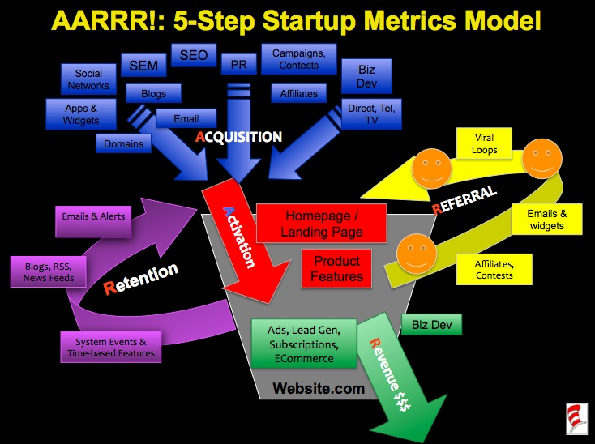

# 'Startup Metrics for Pirates' Talk

Dave McClure discusses 'Startup Metrics for Pirates' which is a different perspective on improving conversion funnels.

[Startup Metrics for Pirates (Youtube Video)](https://www.youtube.com/watch?v=irjgfW0BIrw) [1]

[Slides](https://www.slideshare.net/dmc500hats/startup-metrics-for-pirates-long-version) [2]

**Pirate Metrics - AARRR! [3]**

* Acquisition - You acquire the user. For a SaaS product, this usually means a sign up.
* Activation - The user uses your product, indicating a good first visit.
* Retention - The user continues to use your product, indicating they like your product.
* Referrals - The user likes your product so much he refers other new users.
* Revenue - The user pays you.

**AARRR! Customer Lifecycle/Conversion Behavior**

(Source: [4])

**Example Conversion Metrics**

**Sources**

[1] Startup Metrics for Pirates (https://www.youtube.com/watch?v=irjgfW0BIrw)

[2] 'Startup Metrics for Pirates' slides (https://www.slideshare.net/dmc500hats/startup-metrics-for-pirates-long-version)

[3] http://www.expectedbehavior.com/experiments/pirate_metrics/ , previously  http://piratemetrics.com/

[4] http://500hats.typepad.com/500blogs/2007/09/startup-metrics.html
